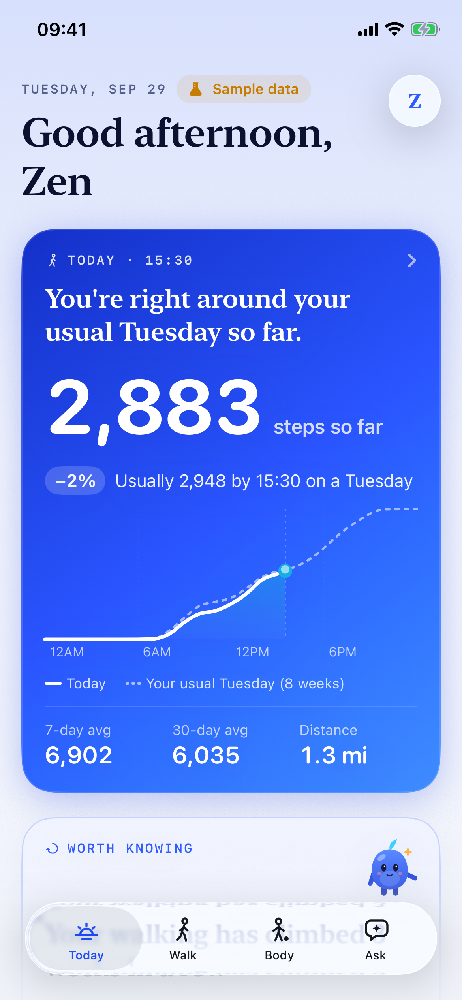
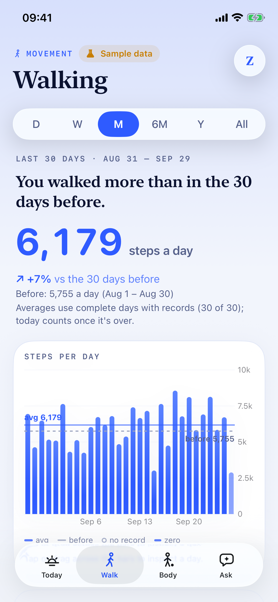
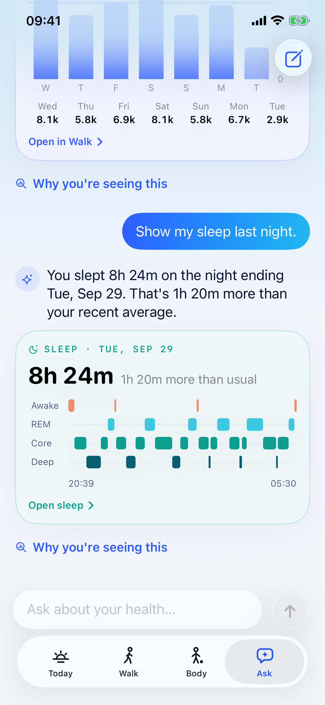
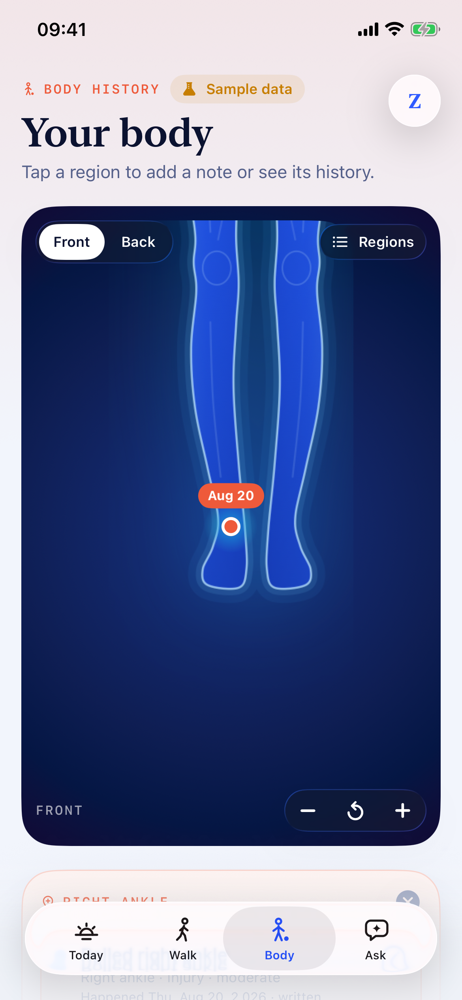
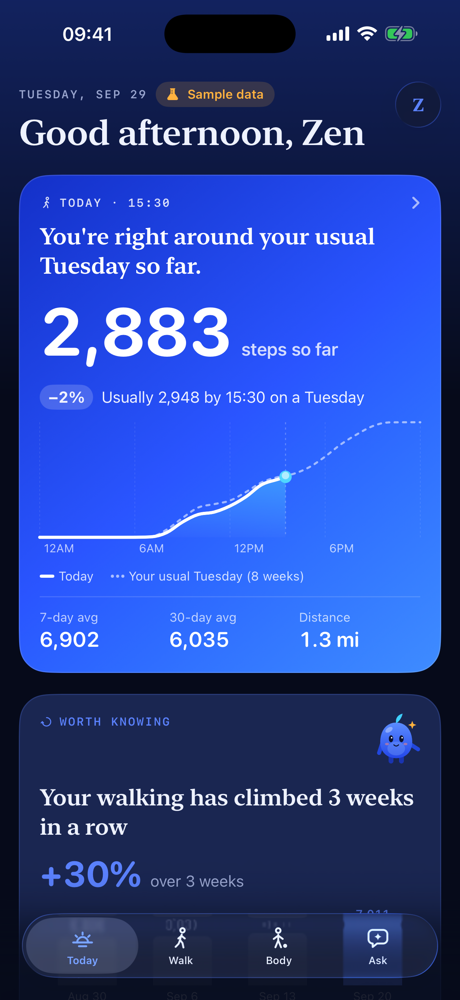

# Blith

A personal health intelligence app for iPhone. Blith turns your Apple Health history into
understanding: it learns **your** normal, notices what changed, explains why it matters with
the evidence behind it, and lets you ask questions that are answered from your real data with
native charts right in the conversation.

**Today** · what matters about you right now, compared with your usual at the same time
**Walk** · every range with its own story, the exact days behind it, and your walking signature
**Body** · a blue body map for dated notes, anchored to regions, with a history timeline
**Ask** · an assistant that computes from your records and answers with native cards

<p>





</p>

_Simulator screenshots from CI using labelled sample data._

## Repository

```
ios/
  project.yml           XcodeGen spec (generates Blith.xcodeproj)
  Config/               xcconfigs (Secrets.xcconfig is gitignored)
  BlithCore/            Swift package: models, sync, store, analytics, insights, AI tools (+ tests)
  Blith/                SwiftUI app: HealthKit provider, design system, features
codemagic.yaml          CI: tests, simulator build, screenshots; TestFlight release
scripts/screenshots.sh  simulator screenshots with sample data
design/                 app icon sources
docs/                   ARCHITECTURE, PRIVACY, HUAWEI, RELEASE
```

## Develop

```bash
# Logic + tests (macOS or Linux, Swift 6)
cd ios/BlithCore && swift test

# Try the assistant against sample data from a terminal
swift run BlithCLI insights balanced
OPENROUTER_API_KEY=… swift run BlithCLI ask "How have I been walking?"

# App (macOS, Xcode 26)
brew install xcodegen
cp ios/Config/Secrets.example.xcconfig ios/Config/Secrets.xcconfig   # add your OpenRouter key
cd ios && xcodegen generate && open Blith.xcodeproj
```

Launch arguments for testing (Edit Scheme › Arguments): `-BlithDemo balanced` (sample data,
see `DemoScenario`), `-BlithTab walk|ask`, `-BlithSheet sleep|weight|insight`,
`-BlithResetOnboarding YES`.

## AI

Ask uses OpenRouter (default model `openai/gpt-6-luna`, set in `ios/Config/Base.xcconfig`).
The model calls deterministic tools in `HealthAssistantTools`; all numbers come from
`BlithCore`, and widgets are native components chosen by type. Without a key, without network,
or if the user declines AI sharing, Ask answers on-device with the same tools.

See `docs/DESIGN.md` for the design language, `docs/ARCHITECTURE.md` for engineering decisions and `docs/RELEASE.md` for App Store readiness.
