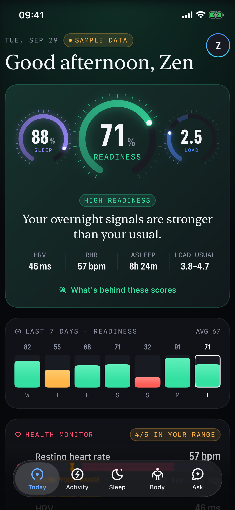
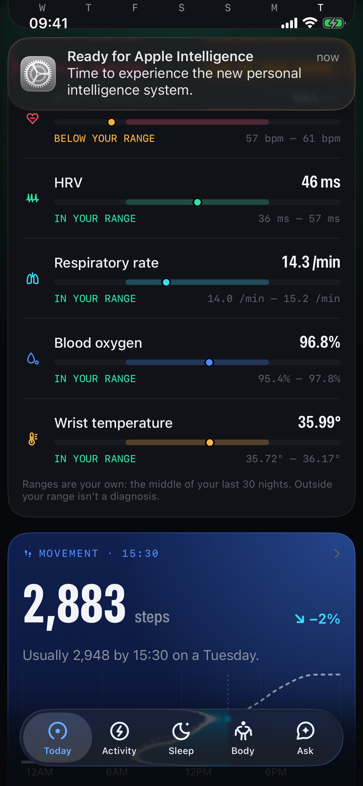
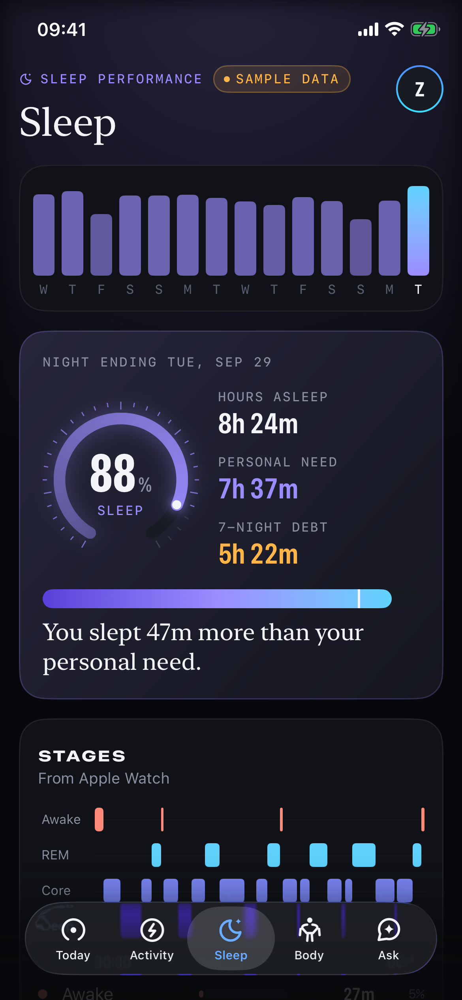
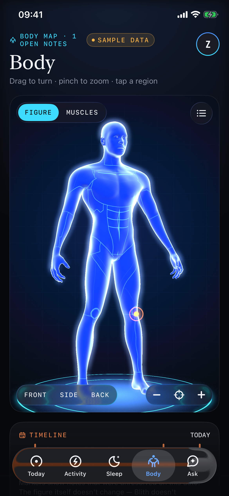
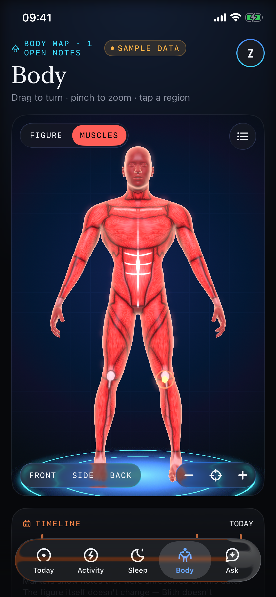
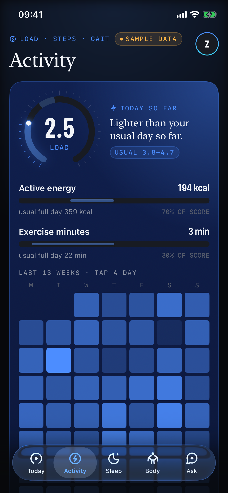
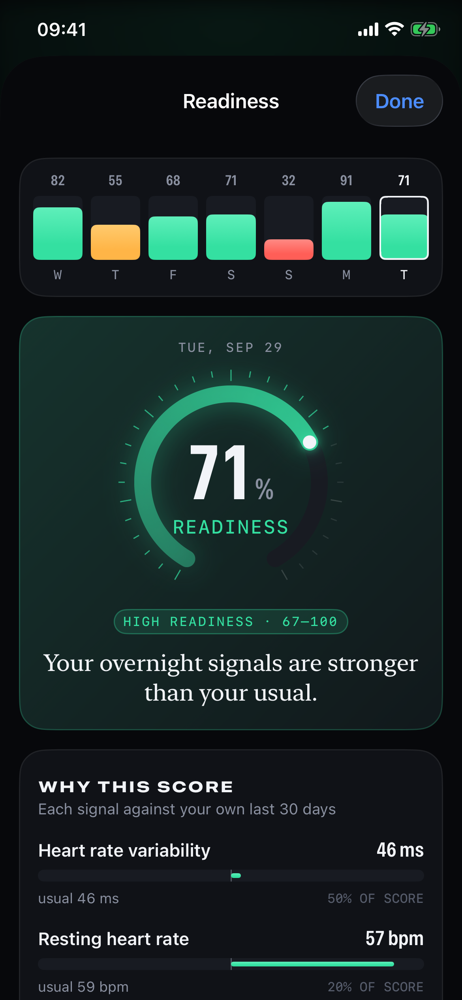
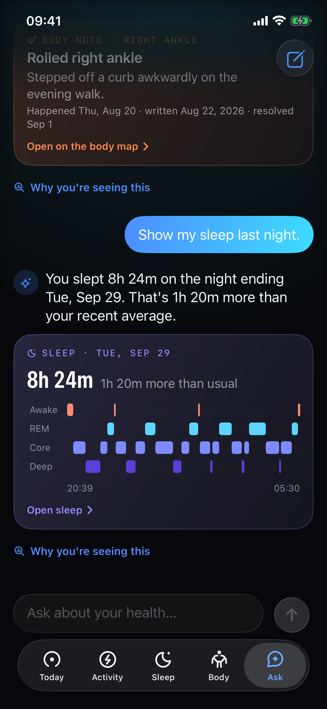

# Blith

A personal health intelligence app for iPhone, built like an instrument. Blith turns your Apple
Health history into three daily scores measured against **you**:

- **Readiness**: overnight HRV and resting heart rate against your own baseline, plus sleep.
- **Sleep performance**: sleep measured against your personal need.
- **Load**: how much the day asked of your body.

It also shows your overnight readings against your own usual ranges and a 3D body map for dated notes,
and answers questions from your real data with native cards. Every number is one tap away from the
factors behind it.

**Today** · readiness on a 0–100 line against your usual (movement leads without an Apple Watch), sleep and load, live heart rate, what's worth a look, and your overnight readings
**Activity** · load against your usual range, steps with a story for every range, gait and your walking signature
**Sleep** · stages, efficiency, time to fall asleep, wake-ups, consistency, 7-night sleep debt, a suggestion for tonight and a 13-week heatmap
**Body** · a free-rotating 3D male figure from BodyParts3D / Z-Anatomy (CC BY-SA) with region notes, a timeline and a muscle layer of 242 named muscles
**Ask** · an assistant that computes from your records and answers with native cards

<p>








</p>

_Simulator screenshots from CI using labelled sample data. Design language: `docs/DESIGN.md` (v4 "Signal", light and dark)._

## Repository

```
ios/
  project.yml           XcodeGen spec (generates Blith.xcodeproj)
  Config/               xcconfigs (Secrets.xcconfig is gitignored)
  BlithCore/            Swift package: models, sync, store, analytics, insights, AI tools (+ tests)
  Blith/                SwiftUI app: HealthKit provider, design system, features
codemagic.yaml          CI: tests, simulator build, screenshots; TestFlight release
scripts/screenshots.sh  simulator screenshots with sample data
design/                 icon, symbols, 3D body generator (design/body3d), screenshots
docs/                   DESIGN, ARCHITECTURE, PRIVACY, HUAWEI, RELEASE
```

## Develop

```bash
# Logic + tests (macOS or Linux, Swift 6)
cd ios/BlithCore && swift test

# Try the assistant against sample data from a terminal
swift run BlithCLI insights balanced
OPENROUTER_API_KEY=… swift run BlithCLI ask "How have I been walking?"

# App (macOS, Xcode 26)
brew install xcodegen
cp ios/Config/Secrets.example.xcconfig ios/Config/Secrets.xcconfig   # add your OpenRouter key
cd ios && xcodegen generate && open Blith.xcodeproj
```

Launch arguments for testing (Edit Scheme › Arguments): `-BlithDemo balanced` (sample data,
see `DemoScenario`), `-BlithTab walk|sleep|body|ask`, `-BlithSheet readiness|vital|weight|insight`,
`-BlithBodyLayer muscle`, `-BlithScrollTo monitor`, `-BlithResetOnboarding YES`.

## AI

Ask uses OpenRouter (default model `openai/gpt-6-luna`, set in `ios/Config/Base.xcconfig`).
The model calls deterministic tools in `HealthAssistantTools`; all numbers come from
`BlithCore`, and widgets are native components chosen by type. Without a key, without network,
or if the user declines AI sharing, Ask answers on-device with the same tools.

See `docs/DESIGN.md` for the design language, `docs/ARCHITECTURE.md` for engineering decisions and `docs/RELEASE.md` for App Store readiness.
